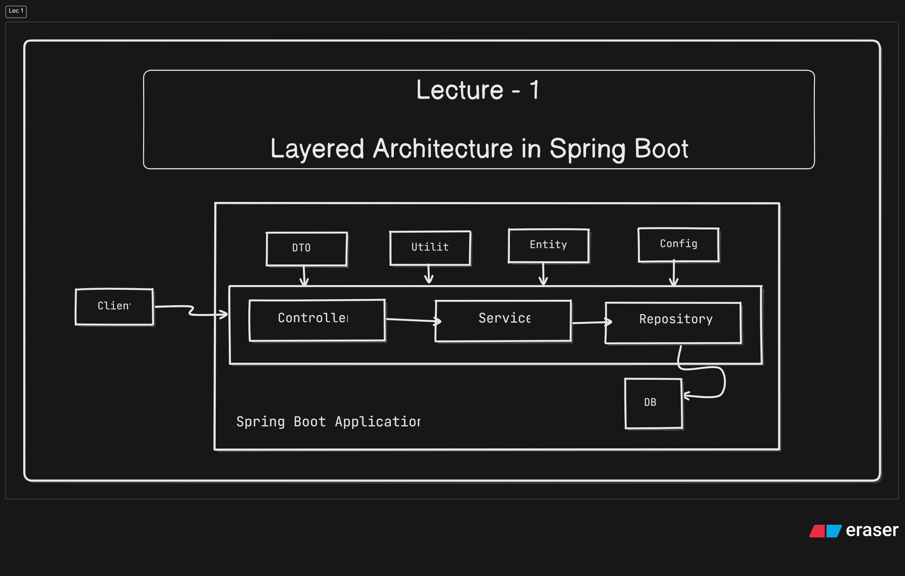
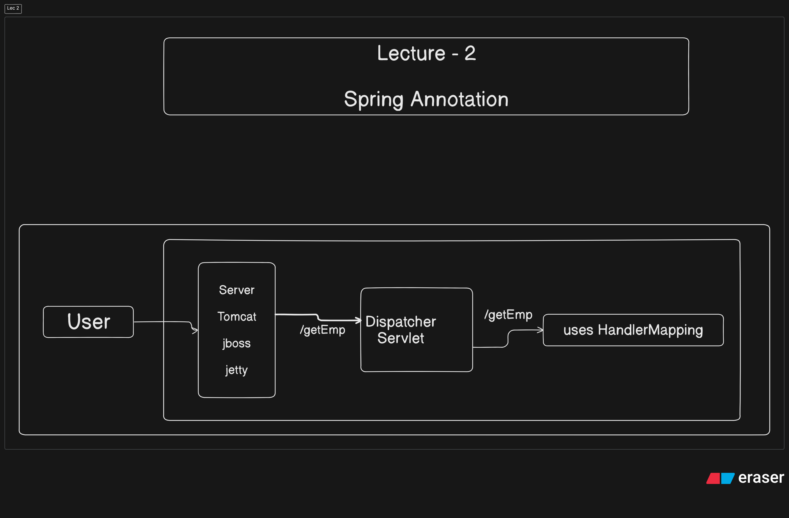
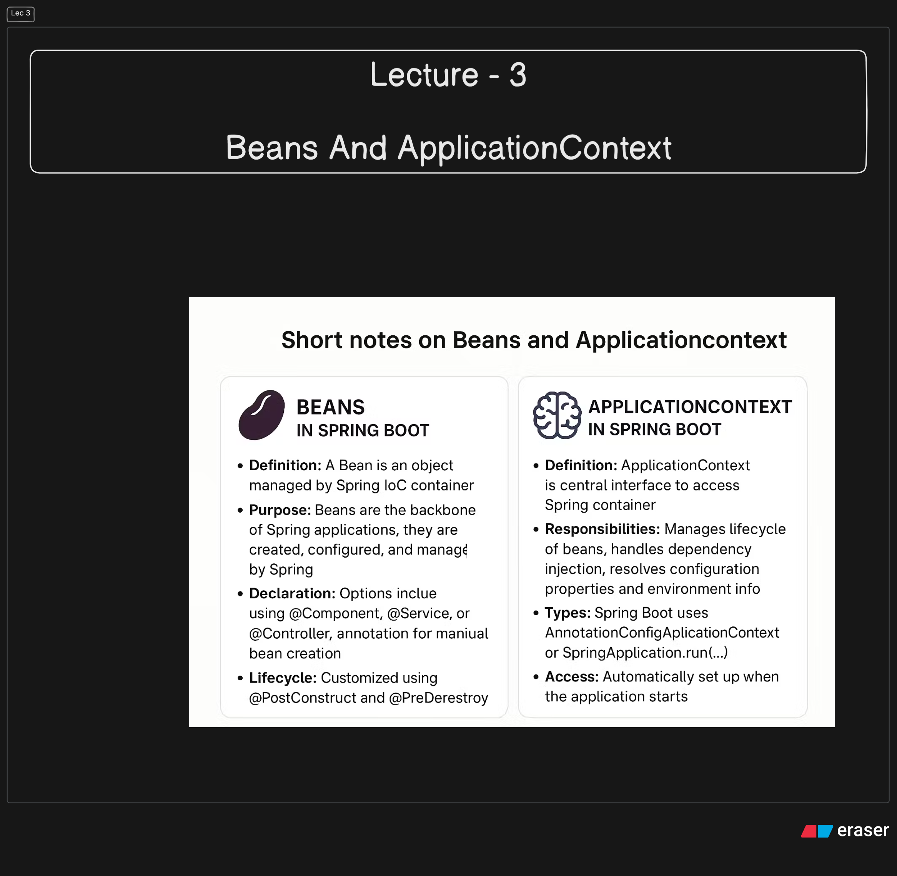
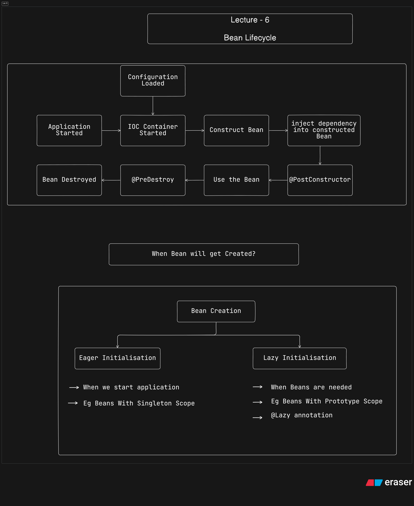
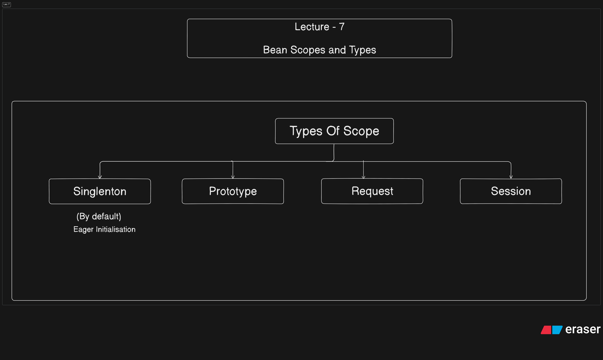
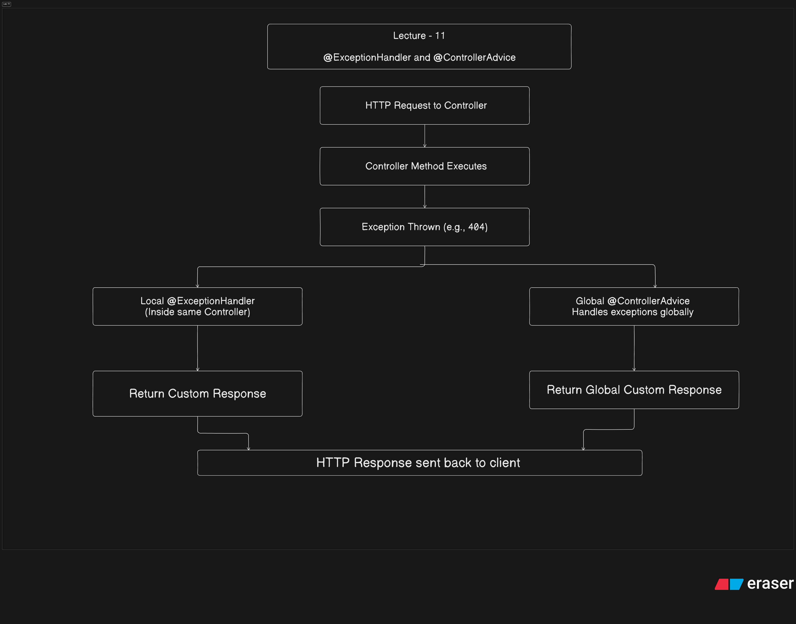
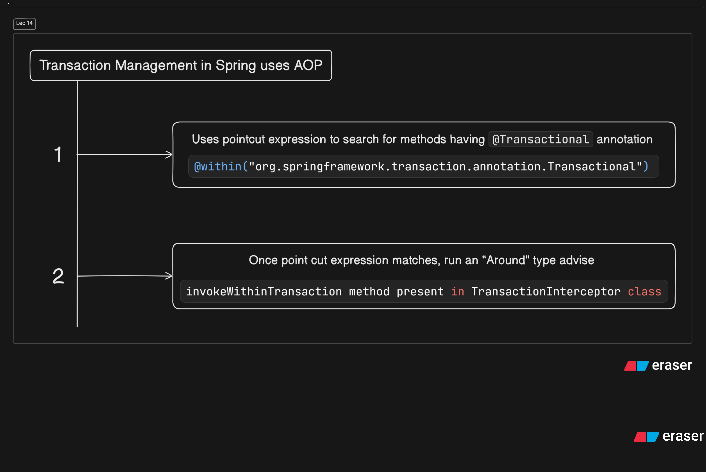

# SpringBoot Basic Notes


# Lecture - 1 
# **Layered Architecture in Spring Boot**
### ✅ **1. DTO (Data Transfer Object)**


- **Purpose:** Transfers data between layers (e.g., Controller ⇄ Service).
- 
- **Why important:**
    - Prevents exposing internal entities to external APIs.
    - Allows validation and transformation of data.
- **Example:** `UserDTO`  used to accept or return user info without exposing sensitive fields.
---

### ✅ **2. Utility Classes**
- **Purpose:** Common helper methods used across the application.
- **Why important:**
    - Avoids code duplication.
    - Centralizes reusable logic (e.g., string formatting, date conversion, token generation).
- **Example:** `JwtUtil`  for generating and validating JWT tokens.
---

### ✅ **3. Entity**
- **Purpose:** Represents a table in the database using JPA/Hibernate.
- **Why important:**
    - Used for ORM (Object-Relational Mapping).
    - Each instance maps to a row in a database table.
- **Example:** `User`  entity maps to `users`  table.
---

### ✅ **4. Config Files**
- **Includes:** `application.properties`  or `application.yml` , custom config classes.
- **Purpose:** Stores application settings (DB URL, port, security, etc.) and beans.
- **Why important:**
    - Centralized configuration management.
    - Enables customization via profiles (`dev` , `prod` ).
    - Beans configured in `@Configuration`  classes help control behavior (e.g., CORS, security rules).







---

# Lecture - 3
# Beans And ApplicationContext


### 🫘 **Beans in Spring Boot**
- **Definition**: A **Bean** is an object that is managed by the Spring IoC (Inversion of Control) container.
- **Purpose**: Beans are the backbone of Spring applications; they are created, configured, and managed by Spring.
- **Declaration**:
    - Using `@Component` , `@Service` , `@Repository` , or `@Controller`  annotations (auto-detection).
    - Or using `@Bean`  inside a `@Configuration`  class for manual bean creation.
- **Lifecycle**:
    - Created when the application context is initialized.
    - Can be customized using `@PostConstruct`  and `@PreDestroy` .
---

### 🧠 **ApplicationContext in Spring Boot**
- **Definition**: `ApplicationContext`  is the central interface to access the Spring container.
- **Responsibilities**:
    - Manages the lifecycle of beans.
    - Handles dependency injection.
    - Resolves configuration properties and environment info.
- **Types**: Spring Boot uses `AnnotationConfigApplicationContext`  or `SpringApplication.run(...)` .
- **Access**:
    - Automatically set up when the application starts.
    - Can be injected using `@Autowired`  or accessed via `ApplicationContextAware` .



---

#  Lecture - 4
#  Dependency Injection 


### 🔗 **Dependency Injection (DI) in Spring Boot)**
- **Definition**: DI is a design pattern where Spring automatically provides the required objects (dependencies) to a class.
- **Purpose**: Promotes loose coupling, easier testing, and better maintainability.
- **Spring Boot Role**: Spring’s IoC (Inversion of Control) container handles DI automatically.
---

### ⚙️ **Types of Dependency Injection**
1. **Constructor Injection**
    - Dependencies are provided through the class constructor.
    - ✅ Recommended for mandatory dependencies.
    - **Example**:@Component
public class UserService {
    private final UserRepository userRepository;

    public UserService(UserRepository userRepository) {
        this.userRepository = userRepository;
    }
}
2. **Setter Injection**
    - Dependencies are set using setter methods.
    - ✅ Good for optional dependencies.
    - **Example**:@Component
public class UserService {
    private UserRepository userRepository;

    @Autowired
    public void setUserRepository(UserRepository userRepository) {
        this.userRepository = userRepository;
    }
}
3. **Field Injection**
    - Dependencies are injected directly into fields.
    - ❌ Not recommended for unit testing (hard to mock).
    - **Example**:@Component
public class UserService {
    @Autowired
    private UserRepository userRepository;
}


## Constructor Injection
Dependency will be resolve at the time of initialization of object.

Its recommended.

When a constructor is present @Autowired is not mandatory.


## Advantage:
All mandatory dependency will be inject at the time of inisitialization itself.

Make 100% sure that our object will be initialized with all the required dependencies.

Avoid NullPointException.

We can create immutable (can use final keyword) object.

Fail Fast - Fail at compilation only in case of missing dependencies.


#  Lecture - 5
#                       @ComponentScan 


### 🔍 `@ComponentScan` Annotation in Spring Boot – Short Notes
---

#### ✅ **Purpose**
`@ComponentScan` tells Spring where to look for **components**, **services**, **repositories**, and other Spring-managed beans.

---

#### 🧠 **Default Behavior**
- If you use `@SpringBootApplication`  (which includes `@ComponentScan` ), it scans the **current package and all sub-packages**.
---

#### 🔧 **Use Case (Manual)**
If your components are **outside the default package**, specify base packages like:

```java
@ComponentScan(basePackages = {"com.example.service", "com.example.util"})
```
---

#### 🔗 **Works With**
- `@Component` 
- `@Service` 
- `@Repository` 
- `@Controller` 
Only classes annotated with these will be picked up during scanning.

---

#### 📌 **Example**
```java
@Configuration
@ComponentScan(basePackages = "com.myapp.services")
public class AppConfig {
}
```
---

#### 📝 **In **`**@SpringBootApplication**` 
```java
@SpringBootApplication(scanBasePackages = "com.myapp")
public class MainApp {
}
```
---


#                                    Lecture - 6 
#                                 Bean Lifecycle


Here’s a **short and clear explanation** of the **Bean Lifecycle** in Spring along with `@PostConstruct` and `@PreDestroy` annotations:

---

### 🌱 **Spring Bean Lifecycle (Simplified)**
1. **Instantiation** – Spring creates the bean object.
2. **Populate Properties** – Dependencies are injected.
3. **BeanNameAware / BeanFactoryAware / ApplicationContextAware** – (Optional) Callbacks.
4. **@PostConstruct** – Custom initialization (after dependencies are injected).
5. **afterPropertiesSet()** – From `InitializingBean`  interface (optional).
6. **Custom init-method** – If defined in config.
7. ✅ **Bean is ready to use**
8. **@PreDestroy** – Called before bean is removed/destroyed.
9. **destroy()** – From `DisposableBean`  interface (optional).
10. **Custom destroy-method** – If defined in config.
---

### ✅ `@PostConstruct` Annotation
- 📌 Runs **after dependency injection** is done.
- 💡 Used for **custom init logic** (e.g., connecting to a service, logging).
```java
@PostConstruct
public void init() {
    System.out.println("Bean is initialized");
}
```
---

### ❌ `@PreDestroy` Annotation
- 📌 Runs **before the bean is destroyed**.
- 💡 Used for **cleanup tasks** (e.g., closing connections, releasing resources).
```java
@PreDestroy
public void cleanup() {
    System.out.println("Bean is about to be destroyed");
}
```
---

### ⚠️ Notes
- Both are from `**javax.annotation**`  or `**jakarta.annotation**`  (depending on Spring version).
- Only work on **singleton** beans by default.
- Requires the bean to be **managed by Spring container**.
---




---

#                                    Lecture - 7
#                                Types of Bean


### 🌱 Types of Beans in Spring Framework
In Spring, **beans** are objects managed by the Spring IoC container. Based on their **scope**, beans are categorized as follows:

---

### 🔁 1. **Singleton (Default)**
- Only **one instance** is created for the entire Spring container.
- Shared across the application.
- Eager Initialization
```java
@Scope("singleton")
```
---

### 🔄 2. **Prototype**
- A **new instance** is created **every time** the bean is requested.
- Lazily Initialized - New Object is created each time - created when needed
```java
@Scope("prototype")
```
---

### 🧑‍🤝‍🧑 3. **Request** (Web Applications Only)
- A new bean is created for **each HTTP request**.
- Lazily Initialized
- proxyMode - injecting request scoped bean in singlenton scoped bean
```java
@Scope("request")
```
---

### 🌐 4. **Session** (Web Applications Only)
- A new bean is created for **each HTTP session**.
- Lazily Initialized
- When user access any API, session is created
- Remains active till session is expires
```java
@Scope("session")
```
---

### 📦 5. **Application**
- A single bean is created for **one servlet context** (i.e., for the entire app lifecycle).
```java
@Scope("application")
```
---

### 🔐 6. **Websocket**
- A bean is created and tied to a **websocket lifecycle**.
```java
@Scope("websocket")
```
---

### 🔧 Example Usage:
```java
@Component
@Scope("prototype")
public class MyBean {
    // custom logic
}
```
---




#                                              Lecture - 8
#                                  @Primary &  @Component 


### ✅ `@Component`  
**What it is:**

- A **stereotype annotation** used to mark a class as a **Spring-managed bean** (i.e., eligible for dependency injection).
**Why we need it:**

- It tells Spring to **auto-detect and register** the class as a bean during **component scanning**.
**Example:**

```java
@Component
public class MyService {
    // This class will be automatically registered as a bean
}
```
---

### ✅ `@Primary`  
**What it is:**

- An annotation used to mark a **preferred bean** when **multiple candidates** are found for autowiring.
**Why we need it:**

- When more than one bean of the same type exists, Spring doesn't know which one to inject. `@Primary`  tells Spring which one to choose **by default**.
**Example:**

```java
@Component
@Primary
public class MySQLDatabase implements Database {}

@Component
public class PostgreSQLDatabase implements Database {}
```
```java
@Autowired
private Database database; // MySQLDatabase will be injected by default
```
---

### Summary:
| Annotation | Purpose | When Needed |
| ----- | ----- | ----- |
|  | Register class as a Spring bean | For DI and auto-scanning of components |
|  | Resolve conflict when multiple beans are found | To set default bean among multiple beans |


#                                              Lecture - 9
#                                  @ConditionalOnProperty 


### ✅ `@ConditionalOnProperty` 
**What it is:**

- A Spring Boot annotation used to **conditionally enable a bean** based on the value of a property defined in `application.properties`  or `application.yml` .
---

### ✅ Why we need it:
- To **load or skip beans/configurations** based on **external configuration**, making the app **more flexible** and **environment-specific**.
---

### ✅ Syntax:
```java
@ConditionalOnProperty(
    name = "feature.enabled",
    havingValue = "true"
)
@Bean
public MyService myService() {
    return new MyService();
}
```
---

### ✅ Use Case Example:
```properties
# application.properties
feature.enabled=true
```
- If `feature.enabled=true` , the bean is created.
- If it's missing or false, the bean is **not** loaded.
---

### ✅ Summary Table:
| Feature | Description |
| ----- | ----- |
| Annotation |  |
| Purpose | Load beans conditionally based on property values |
| Common Use Case | Feature toggles, environment-specific configs |
| Benefits | Flexibility, cleaner config, avoids unnecessary beans |


#                                          Lecture - 10
#                                  Profiling and @Profile 


### ✅ `@Profile` Annotation & Profiling – Short Notes
---

### 🔹 What is Profiling?
**Profiling** in Spring means defining **different configurations for different environments**, like:

- `dev`  (development)
- `test`  (testing)
- `prod`  (production)
---

### ✅ What is `@Profile`?
- `@Profile`  is a Spring annotation used to **activate beans only for specific environments**.
---

### ✅ Why We Need It:
- To **separate environment-specific code/configurations**.
- Helps in **avoiding manual changes** across environments.
- Improves **code maintainability** and **deployment flexibility**.
---

### ✅ Example:
```java
@Profile("dev")
@Component
public class DevDatabaseConfig implements DatabaseConfig {}

@Profile("prod")
@Component
public class ProdDatabaseConfig implements DatabaseConfig {}
```
```properties
# application.properties
spring.profiles.active=dev
```
- Only `DevDatabaseConfig`  will be loaded.
---

### ✅ Importance:
| Benefit | Description |
| ----- | ----- |
| Environment Isolation | Keeps dev/test/prod logic separate |
| Easier Testing | Run different setups for testing vs prod |
| Cleaner Configuration Management | Only loads what’s needed for each profile |
| Safer Deployments | Avoids dev configs leaking into prod |
---

### ✅ Summary:
| Annotation | Purpose | Usage |
| ----- | ----- | ----- |
|     @Proflie  | Load beans/configs for specific profiles | Used with  |


**Difference between **`**@Profile**`** and **`**@ConditionalOnProperty**` :

---

### ✅ Basic Difference
| Feature |  |  |
| ----- | ----- | ----- |
| **Purpose** | <p>Activates beans for specific </p><p>**Spring profiles**</p> | <p>Activates beans based on </p><p>**property values**</p> |
| **Configuration Based On** |  | <p>Any custom property (e.g., </p><p>)</p> |
| **Used For** | Environment-specific beans/config | Feature toggles or optional bean loading |
---

### ✅ Example
#### ➤ `@Profile`:
```java
@Profile("dev")
@Component
public class DevService {}
```
```properties
spring.profiles.active=dev
```
➡ Only loaded when `dev` profile is active.

---

#### ➤ `@ConditionalOnProperty`:
```java
@ConditionalOnProperty(name = "feature.logging", havingValue = "true")
@Bean
public LoggerService loggerService() { ... }
```
```properties
feature.logging=true
```
➡ Only loaded when `feature.logging` is set to `true`.

---

### ✅ When to Use What?
| Use Case | Use |
| ----- | ----- |
| Switch between dev/test/prod env |  |
| Toggle features/modules on/off |  |
| Load config based on environment |  |
| Load bean based on property value |  |
---

### ✅ Summary:
- `**@Profile**`  → Profile-based (environment-level)
- `**@ConditionalOnProperty**`  → Property-based (feature-level or toggle)
Let me know if you want a visual diagram or real-world scenario.


#                                      Lecture - 11
# @ExceptionHandler and @ControllerAdvice 


---

### ✅ `@ExceptionHandler` 
**What it is:**

- A Spring annotation used to **handle specific exceptions** thrown in a controller.
**Why we need it:**

- To write **custom error handling logic** (like returning user-friendly messages or custom HTTP status codes) for exceptions.
**Example:**

```java
@ExceptionHandler(ResourceNotFoundException.class)
public ResponseEntity<String> handleNotFound(ResourceNotFoundException ex) {
    return new ResponseEntity<>(ex.getMessage(), HttpStatus.NOT_FOUND);
}
```
📌 **Note:** This only works **within the same controller** unless used with `@ControllerAdvice`.

---

### ✅ `@ControllerAdvice` 
**What it is:**

- A **global exception handling** mechanism in Spring.
- Makes `@ExceptionHandler`  methods apply **across all controllers**.
**Why we need it:**

- To centralize exception handling logic in one place, keeping controllers clean.
**Example:**

```java
@ControllerAdvice
public class GlobalExceptionHandler {

    @ExceptionHandler(Exception.class)
    public ResponseEntity<String> handleAllExceptions(Exception ex) {
        return new ResponseEntity<>("Something went wrong!", HttpStatus.INTERNAL_SERVER_ERROR);
    }
}
```
---

### ✅ Key Differences
| Feature |  | <p></p><p></p> |
| ----- | ----- | ----- |
| Scope | Local (only current controller) | Global (all controllers) |
| Purpose | Handle specific exception locally | Centralized error handling for whole application |
| Best Used For | Small apps or unique cases | Large apps, cleaner architecture |
---

### ✅ Importance
- Improves **readability** and **maintainability**
- Helps return **custom, consistent** error responses (JSON, status codes)
- Keeps controller logic **focused on business**, not error handling
---

```
┌────────────────────────────┐
                │   HTTP Request to Controller│
                └────────────┬───────────────┘
                             │
                             ▼
                ┌────────────────────────────┐
                │  Controller Method Executes │
                └────────────┬───────────────┘
                             │
                             ▼
               ┌───────────────────────────────┐
               │ Exception Thrown (e.g., 404)   │
               └────────────┬──────────────────┘
                            │
     ┌──────────────────────┴────────────────────────┐
     │                                               │
     ▼                                               ▼
┌───────────────┐                        ┌────────────────────────────┐
│Local @ExceptionHandler                │Global @ControllerAdvice     │
│(Inside same Controller)               │Handles exceptions globally  │
└──────┬────────────┘                   └────────────┬────────────────┘
       │                                              │
       ▼                                              ▼
┌────────────────────┐                    ┌──────────────────────────────┐
│Return Custom Response│                  │Return Global Custom Response │
└──────────┬──────────┘                   └────────────┬─────────────────┘
           ▼                                           ▼
         ┌────────────────────────────────────────────────┐
         │         HTTP Response sent back to client       │
         └────────────────────────────────────────────────┘
```




#                                          Lecture - 12
#                              @Aspect and Spring AOP 


### ✅ AOP in Spring Boot – Short Notes
---

### 🔹 What is AOP?
**AOP (Aspect-Oriented Programming)** is a programming paradigm that helps separate **cross-cutting concerns** (like logging, security, transactions) from the main business logic.

In **Spring Boot**, AOP is implemented using **Spring AOP** (based on proxies).

---

### ✅ Key AOP Terms:
| Term | Meaning |
| ----- | ----- |
| **Aspect** | The class containing cross-cutting logic (@Aspect) |
| **Advice** | The method that runs at a specific join point (e.g. `@Before`, `@After` ) |
| **Join Point** | A point in code (like method execution) where advice can be applied |
| **Pointcut** | A condition/expression to match join points (e.g., method name match) |
| **Weaving** | Linking aspects with application code at runtime (via proxy) |
---

### ✅ AOP Example in Spring Boot:
```java
@Aspect
@Component
public class LoggingAspect {

    @Before("execution(* com.example.service.*.*(..))")
    public void logBefore(JoinPoint joinPoint) {
        System.out.println("Method called: " + joinPoint.getSignature().getName());
    }
}
```
---

### ✅ Why We Need AOP
- To avoid **code duplication** of cross-cutting concerns.
- Keeps **business logic clean**.
- Centralizes logic like:
    - Logging
    - Security
    - Performance monitoring
    - Exception tracking
    - Transaction management
---

### 🔄 Difference: AOP vs OOP
| Feature | OOP (Object-Oriented Programming) | AOP (Aspect-Oriented Programming) |
| ----- | ----- | ----- |
| **Focus** | <p>Organizes code into </p><p>**objects/classes**</p> | <p>Separates </p><p>**cross-cutting concerns**</p> |
| **Structure** | Encapsulation, Inheritance, Polymorphism | Aspects, Advices, Pointcuts |
| **Used For** | Core business logic | Logging, Security, Transactions, Exception Handling |
| **Code Placement** | Cross-cutting code is scattered across many classes | Cross-cutting code is centralized in one aspect class |
| **Example Concern** | CustomerService class with business logic | LoggingAspect for logging across all service methods |
---

### ✅ Summary
- **OOP** → Solves business problems using objects.
- **AOP** → Solves **cross-cutting** problems cleanly, reducing repetition.
- In Spring Boot, AOP is used to write cleaner, modular, and maintainable code.


```
                    ┌──────────────────────────────┐
                    │      Client Sends Request    |
                    └─────────────┬────────────────┘
                                  │
                                  ▼
                     ┌──────────────────────────┐
                     │  Spring Boot Controller  │
                     └─────────────┬────────────┘
                                  │
                                  ▼
                 ┌────────────────────────────────┐
                 │     Target Service Method      |
                 │ (e.g., orderService.placeOrder)|
                 └─────────────┬──────────────────
                               │
           ┌──────────────────┼────────────────────┐
           │                  │                    │
           ▼                  ▼                    ▼
┌────────────────┐  ┌────────────────────┐  ┌────────────────────┐
│  @Before Advice│  │  @Around Advice    |  │  @AfterReturning    │
│ (Before method)│  │ (Before & After)   │  │ (After success)     │
└────────────────┘  └────────────────────┘  └────────────────────┘
           ▲                   ▲                     ▲
           └───────────────┬───┴─────────────────────┘
                           ▼
           ┌─────────────────────────────────┐
           │  Cross-Cutting Logic Executed   │
           └─────────────────────────────────┘
                           │
                           ▼
            ┌───────────────────────────────┐
            │    Business Logic Executes    │
            └───────────────────────────────┘
                           │
                           ▼
            ┌───────────────────────────────┐
            │     Response Returned to      │
            │         Controller            │
            └───────────────────────────────┘
                           │
                           ▼
            ┌───────────────────────────────┐
            │     Response Sent to Client   │
            └───────────────────────────────┘
```


---

## ✅ What is AOP?
**AOP (Aspect-Oriented Programming)** is a programming paradigm that helps you **separate cross-cutting concerns** (like logging, security, transactions) from the **core business logic**.

---

## 🎯 Why AOP?
In traditional OOP:

- Cross-cutting concerns (e.g., logging) get scattered across many classes.
- This leads to **duplicate code**, **tight coupling**, and **harder maintenance**.
AOP helps by:

✅ Keeping cross-cutting code **centralized**
 ✅ Making business logic **cleaner** and **more focused**
 ✅ Promoting **modularity** and **reuse**

---

## 💡 Common Cross-Cutting Concerns
- Logging
- Security
- Transaction management
- Exception handling
- Caching
- Performance monitoring


## 🛠️ Types of Advice in Spring AOP
| Advice Type | When It Runs | Annotation |
| ----- | ----- | ----- |
| **Before** | Before method execution | @Before  |
| **After** | After method (whether success/fail) | @After |
| **AfterReturning** | After method returns successfully | @AfterReturing  |
| **AfterThrowing** | After method throws exception | @AfterThrowing  |
| **Around** | Around method (before + after + control) | @Aroung  |


## ✅ Example Code
### 1. Add AOP dependency (if using Maven):
```xml
<dependency>
    <groupId>org.springframework.boot</groupId>
    <artifactId>spring-boot-starter-aop</artifactId>
</dependency>
```
---

### 2. Create a Business Service
```java
@Service
public class OrderService {
    public void placeOrder() {
        System.out.println("Placing Order...");
    }
}
```
---

### 3. Create an Aspect
```java
@Aspect
@Component
public class LoggingAspect {

    @Before("execution(* com.example.service.*.*(..))")
    public void logBefore(JoinPoint joinPoint) {
        System.out.println("Before: " + joinPoint.getSignature().getName());
    }

    @After("execution(* com.example.service.*.*(..))")
    public void logAfter(JoinPoint joinPoint) {
        System.out.println("After: " + joinPoint.getSignature().getName());
    }
}
```
---

## 🧪 Output When `placeOrder()` Is Called
```
Before: placeOrder
Placing Order...
After: placeOrder
```
---

## 🔍 Example Pointcut Expressions
| Expression | Meaning |
| ----- | ----- |
| execution(* com.example..*.*(..)) | Any method in and subpackages |
| execution(* *..*Service.*(..)) | Any method in a class ending with  |
| execution(public void placeOrder()) | Specific method |
---


## ✅ Advantages of AOP
- ✅ Cleaner and modular code
- ✅ Avoids boilerplate repetition
- ✅ Centralized error handling/logging
- ✅ Easier testing and maintenance
---

## ⚠️ Limitations of Spring AOP
- Works **only on Spring beans**
- Only supports **method-level interception** (not field or constructor)
- Uses **proxy-based approach** (AspectJ needed for compile-time weaving)
---

## 📌 Real-World Use Cases
- Log every API call
- Secure endpoints based on roles
- Start/commit transactions
- Catch and log exceptions globally
- Measure method execution time
---

---

#                             Lecture - 14
# **                Transactions and Caching**


## Critical Operation or Critical Section
Code segment where shared resources are being accessed and modified 

```
{
  Read Flight Seat With ID 1
      if SeatStatus is Available
          update to booked
}
```
When multiple requests try to access this critical section, data inconsistency can happend.

What is solution??  => **Transaction **

---

---

### 🔹 What is a Transaction?
**Transaction** helps to achive ACID Properties.

A **transaction** is a sequence of operations performed as a single logical unit of work. Either **all** operations succeed (commit) or **none** (rollback).

---

| Property | Meaning | Purpose |
| ----- | ----- | ----- |
| **A **– Atomicity | All operations in a transaction complete, or none do | <p>Ensures </p><p>**all-or-nothing**</p> |
| **C **– Consistency | Transaction brings DB from one valid state to another | <p>Maintains </p><p>**data integrity**</p> |
| **I **– Isolation | Concurrent transactions don't affect each other | <p>Prevents </p><p>**conflicts**</p> |
| **D **– Durability | Committed data is saved permanently | <p>Ensures </p><p>**data survives crashes**</p> |
---

### 🔹 Why Use Transactions?
- **Data Consistency**: Prevents partial updates.
- **Atomicity**: All operations are completed successfully or none at all.
- **Rollback**: Automatically undoes changes when an error occurs.
---

### 🔹 Enabling Transactions in Spring Boot
Just use `@EnableTransactionManagement` in your `@SpringBootApplication` (optional, as Spring Boot auto-configures it).

---

### 🔹 `@Transactional` Annotation  => can be use in Class Level and Method Level
here we use Method Level

Used to define **transaction boundaries**.

```java
@Service
public class BankService {

    @Autowired
    private AccountRepository accountRepository;

    @Transactional
    public void transferMoney(Long fromId, Long toId, Double amount) {
        Account from = accountRepository.findById(fromId).get();
        Account to = accountRepository.findById(toId).get();

        from.setBalance(from.getBalance() - amount);
        to.setBalance(to.getBalance() + amount);

        accountRepository.save(from);
        accountRepository.save(to);
        
        // if something goes wrong, entire transaction will be rolled back
    }
}
```
For Class level we need to add `@Transactional`  just under the `@Service`  annotation. this will make all **Public Methods** transactional. **Private Methods** can't be transactional. Even if you annotaed a Private Method with `@Transactional`   it will not be applied.`Transactional`  


---


### 🔹 Rollback Rules
By default, Spring rolls back **only on unchecked exceptions** (i.e., subclasses of `RuntimeException`).

#### You can customize this:
```java
@Transactional(rollbackFor = Exception.class)
```
---

### 🔹 Transaction Propagation Types (Common)
| Type | Behavior |
| ----- | ----- |
| REQUIRED (default) | Joins existing transaction, or creates a new one |
| REQUIRES_NEW | Suspends existing transaction and creates a new one |
| NESTED | Creates nested transaction (rollback only to savepoint) |
| MANDATORY | Must run within a transaction (throws if none exists) |
---

### 🔹 Example with `REQUIRES_NEW` 
```java
@Transactional(propagation = Propagation.REQUIRES_NEW)
public void logTransaction() {
    // will execute in a separate transaction
}
```
---

### 🔹 Common Use-Cases
- Money transfer (banking)
- Order placement (e-commerce)
- Inventory updates
- Multi-table updates
---

```
   +------------------+
   |  Client Request  |
   +------------------+
            |
            v
   +------------------------+
   |  @Transactional Method |
   +------------------------+
            |
   +-------------------------------+
   |  Begin Transaction (Proxy)    |
   +-------------------------------+
            |
            v
+----------------------------+
|   DB Operation 1 (INSERT)  |
+----------------------------+
            |
+----------------------------+
|   DB Operation 2 (UPDATE)  |
+----------------------------+
            |
+----------------------------+
|   DB Operation 3 (DELETE)  |
+----------------------------+
            |
            v
  (Check for Exceptions)
            |
+-----------------------------+
| No Exception → COMMIT      |
| Exception → ROLLBACK       |
+-----------------------------+
            |
            v
    +-----------------+
    | Return Response |
    +-----------------+
```




